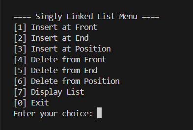

# Singly Linked List Operations in C

- **Name:** `VARSHA RANI`  
- **Company:** `CODTECH IT SOLUTIONS`  
- **ID:** `CT04DF280`  
- **Domain:** `C Programming`  
- **Internship Duration:**  `May 30th, 2025` – `June 30th, 2025`

---

##  Project Overview

This is a console-based **Singly Linked List Management System** written in C that demonstrates fundamental operations on a linked list using pointers and dynamic memory allocation.

The program offers a **menu-driven interface** where the user can:

- Insert a node at the **front**, **end**, or **a specific position**
- Delete a node from the **front**, **end**, or **a specific position**
- Display the linked list at any stage
- Continuously perform operations until the user exits

---
## Screenshots

  <table>
    <tr>
      <td></td>
      <td></td>
    </tr>
  </table>

---

##  Features

- Node creation using dynamic memory
- Efficient insertion at head, tail, or any index
- Safe deletion with position checks and memory deallocation
- Clean and interactive CLI using `system("cls")` and `system("pause")` for Windows
- Clear messages for out-of-range positions or empty list errors

---

##  Tech Used

- **Language:** C Language

---

